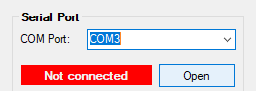
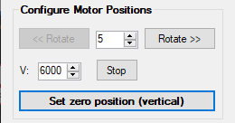

# Table of Contents

- [Introduction](#introduction)
- [System Requirements](#system-requirements)
- [User Guide](#user-guide)
  * [Installing CalibBeamCtrl](#installing-calibbeamctrl)
  * [Preparing the setup](#preparing-the-setup)
  * [Running CalibBeamCtrl](#running-calibbeamctrl)
  * [Troubleshooting](#troubleshooting)
    + [Shutter "dropping"](#shutter-dropping)
    + [Sending commands via serial port software](#sending-commands-via-serial-port-software)
- [Developer Guide](#developer-guide)
  * [Main Project](#main-project)
  * [Setup Project](#setup-project)

# Introduction

The `Calib Beam Ctrl` program is a .NET application running under Windows
meant to send commands to a motor driver board that controls the periodic
rotation of a shutter covering a radioactive source. It was developed for
calibrating the [XL-Calibur instrument](https://sites.wustl.edu/xlcal/home/),
but the software used can be used as a reference to write software (or 
potentially even use as a driver) when calibrating other instruments.

See [System Requirements](#system-requirements) for more details on the setup
this application can work with.


# System Requirements

- Windows: Tested on Windows 10, but should work on Windows 11 (or earlier)
- [.NET v4.6.1](https://dotnet.microsoft.com/en-us/download/dotnet-framework/net461)
- Stepper motor (several available in a cardboard box containing several
  motors and motor driver boards)
- Motor driver used with this version of the app:
  - [EZHR17EN](http://www.allmotion.com/EZHR17ENDescription.htm)
  - RS-485 to RS-232 converter (available in the cardboard box containing
    several motors and motor driver boards)
  - Standard USB to Serial Port converter
- Power supply for the motor driver board:
  - 24V wall-wart power supply or a configurable bench-top power supply
  - Voltage range for the supply: 12-40 V
  - Current consumption of the test setup: ~0.8 A

# User Guide

## Installing CalibBeamCtrl

Before the program can be used, it needs to be installed locally on Windows.

Follow these steps to install `CalibBeamCtrl`:

1. Download the [installer file](https://www.dropbox.com/s/qovgwud9kwxqwqf/CalibBeamCtrl.msi?dl=0).
2. Run the downloaded MSI file in administrator mode.
4. Choose the folder to install to, if the default one is not appropriate.
5. After the installation completes, navigate to the installation folder.
6. Create a shortcut of the `CalibBeamCtrl.exe` to the computer's Desktop,
   so it can be easily run.

Note that the program can also be run directly from Visual Studio, if an
installation of it is available. The installed version is of course the
most out-of-the box solution available -- and is linked to a defined release
of the program.

## Preparing the setup

See the [EZStepper Start Guide](http://www.allmotion.com/New%20PDF's/EZ17_23/EZ_17_23%20EZ%20Start.pdf)
for details on the setup.

For XL-Calibur, the motor to be connected to the EZHR17EN motor driver is
placed inside the calibration setup aluminum cage:


## Running CalibBeamCtrl

1. Apply power to the calibration setup, either from the wall-wart power supply
   or the bench-top power supply.
   - **NOTE:** The EZHR17EN motor driver should be powered with between 12 V and
     40 V! Ensure the power supply can provide at least 1 A of power, the motor
     alone needs about 600 mA!
2. Start the `CalibBeamCtrl` program, e.g., using the Desktop shortcut.
3. Click the **COM Port** drop-down, select the port of the USB to Serial converter
   attached to the EZStepper motor driver and click the **Open** button.

   
       
   - **NOTE:** If there are multiple COM ports and you do not know which port is
   connected to the EZStepper, do the following:
     - Click the drop-down;
     - Grab a glance of which ports appear in the list of COM ports;
     - Disconnect the USB to Serial converter of the EZStepper motor driver;
     - Click the drop-down again;
     - A COM port should have dissapeared;
     - Re-connect the USB to Serial converter;
     - Click the drop-down again;
     - A new COM port should have appeared. This is the COM port of the EZStepper.

4. Confirm that the connection status lights green:

   

5. If you wish to have a log of the steps performed by the program, use the
   check-box under the **Log File** group and the **New...** button to create a new
   log file, or the **Open...** button to open an existing file. In both cases,
   a window opens to select the file to be written to. The file selected is open in
   _append_ mode, i.e., contents will be added to the end of the file.
   
   
   
6. Looking _into_ the shutter, calculate the approximate number of degrees it needs
   to rotate clockwise (right) so that it covers the radioactive source:
   
   
   
7. Type in the angle in degrees in the rotation angle control and click the
   **Rotate >>** button:
   
   
   
8. Tweak the position using the rotation controls until a vertical position
   for the shutter has been found, where it covers the radioactive source:
   
   
   
   - Notes:
     - The **Rotate <<** button is enabled and can be used after the
       motor has been rotated clockwise at least once. Should the rotation
       previously configure go beyound the vertical position, you can rotate
       the shutter counter-clockwise too.
     - The **Stop** button under **Configure Motor Positions** can also be used
       to stop the motor mid-motion.

9. Once the vertical position of the shutter has been found, click the
   **Set zero position (vertical)** button:
   
   

10. Use the controls under the **Calibration Beam** group to select shutter _on_
    and _off_ times. You can configure number of minutes and seconds as desired:
   
    
   
    - Notes:
      - The TAB key on the keyboard can be used to quickly switch between
        controls;
      - The minimum time that the shutter can be both _on_ or _off_ is 10
        seconds; 

11. Click the **Start** button to start the motor control. The **Start** button
    changes into the **Stop** button and the program starts counting the
    selected _off_ time. The progress bar will show the percentage of time
    elapsed:
    
    

12. After the _off_ time you selected elapses, the shutter moves 90 degrees
    clockwise to expose the radioactive source. The beam status label also
    colors green to indicate the beam is _on_ (shutter is _off_). The program
    will count the _on_ time before moving the shutter to the _off_ (beam
    _on_) position. The progress bar will again show the percentage of time
    elapsed in the progress bar:
    
    
    
13. After you are done with the calibration, hit the **Stop** button under
    **Calibration Beam** to stop the motor control.
    
**NOTE:** If you intend to run the motor control again, make sure the shutter is
vertical (covering the radioactive source) and click
**Set zero position (vertical)** before re-starting the motor control.

## Troubleshooting

### Shutter "dropping"

Cases have been observed of the motor controller losing control of the motor's
position ("dropping" the shutter). This is understood to be due to the motor
control velocity being too high, but it can also be that the weight
distribution is not tolerable by the motor controller.

The steps to perform in case this problem appears are:

1. After the shutter has finished spinning, set the zero position using
   the button under **Configure Motor Positions**.
2. Rotate it again to the vertical (zero position) using the rotate
   clockwise and counter-clockwise buttons, as applicable.
3. Set the motor's zero position again using the button.
4. If the motor "drops" again, decrease the velocity via the control
   under **Configure Motor Positions**.
   
   
   
   - Notes:
     - Too low velocity values will result in the motor controller not
       being able to move the shutter at all
     - A good value to try first is **4000**. After this, you can try
       increasing if you like, but there is no great difference between
       hundreds of velocity units.
     - The unit for velocity is motor microsteps per second -- very
       abstract.

### Sending commands via serial port software

If worse comes to worst, you can always try to manually control the
motor controller. The `CalibBeamCtrl` program essentially sends the
commands one can send via serial port software to achieve the motor
control.

The command set for the EZStepper motor driver can be found
at this link:
- http://www.allmotion.com/PDF_Datasheets/Command_Set_EZHR17EN.pdf

Notes:
- Ensure you enable character echoing on the serial port software,
  so you get feedback of the characters sent to the EZStepper. The
  EZStepper itself does no echoing of characters it receives.
- The baud rate for communication is **9600 baud**.
- The EZHR17EN is a bit weird in its behaviour: Although the
  firmware version is listed to be 3.75 (**_CONFIRM!!_**), it seems
  to accept some commands that are only available in later versions,
  according to the command set linked above, but some of the
  commands of later versions are not available on the EZStepper.

To use [TeraTerm](https://tera-term.en.lo4d.com/windows) for sending
commands to the motor driver:

1. Make sure that the USB to Serial converter attached to the
   EZStepper motor controller is connected to the PC and that no
   other programs use this serial port (e.g., click the **Close**
   button under `CalibBeamCtrl` if it has the port open).
2. Open TeraTerm. In the prompt that appears, select the **Serial**
   radio button and use the drop-down to select the port of the
   EZStepper motor driver.
3. Click **OK** to connect to the port.
4. In the TeraTerm window, click the **Setup > Terminal...** menu
   item.
5. Tick the **Local echo** checkbox to enable the echoing of
   characters sent to the EZStepper.
6. Type the following command to get the firmware version of the
   EZStepper:
   
   ```/1&<CR>```
   
   - **NOTE:** `<CR>` is the carriage return character. This
     basically means "hit Enter on your keyboard".
     
   **<!!!SCREENSHOT!!!>**
   
7. Configure the encoder ration via the following command:
   
   ```/1aE64000R<CR>```
   
   - **Notes:**
     - `aE` is the "set encoder ratio" command. This is one of
       the commands that _does not appear_ in the Command Set
       document linked above and according to the document
       should not work with this version of the firmware.
       Abstractly enough, though, it does. The command is
       described in Appendix 8 of the Command Set document.
     - The _64000_ value is obtained as follows:
       - The motor we have is the
         [3509V-18](https://www.dropbox.com/s/tcauprjd3846ymo/3509V-motor-datasheet.pdf?dl=0),
         a 0.9 degree step motor, i.e., 400 turns per full
         360-degree rotation;
       - The motor driver starts at default at 256 microsteps
         per step (can be configured via the `j` command)
       - The encoder we have is an E2 relative optical
         encoder with 400 cycles per revolution and
         1600 pulses per revoltion (4 pulses for every
         cycle);
       - Substitute the above values into the formula
         in Appendix 8 of the Command Set document and:
         
         _aE = ((400x256))/1600 x 1000 = 64000_
     - After the `aE` command is sent, the motor driver
       expects encoder ticks instead of motor microsteps
       as the argument for the `P`, `D` and `A` commands
       (and maybe others too).
         
8. Configure the velocity to `5000` microsteps per second
   by sending the EZStepper the following command:
   
   ```/1V5000R<CR>```
   
   - **Note:** Although the Command Set document states
     that the velocity `V` command should be sent in
     encoder ticks rather than microsteps per second once
     the `aE` command has been sent, this is not the case.
   
9. Rotate the motor 90 degrees in the _positive_
   direction, _clockwise_ when looking _into_ the shutter,
   by using the `P` command as follows:
   
   ```/1P400R<CR>```
   
   - **Notes:**
     - _400/1600 = 1/4 * 360 deg. = 90 deg._
     - General formula for calculating degrees to encoder
       ticks is:
       
       _1600 * angle/360_

10. Rotate the motor 45 degrees in the _negative_ direction,
    i.e., _counter-clockwise_ when looking _into_ the
    shutter, by sending the following command:
    
    ```/1D200R<CR>```
    
    - **Notes:**
      - _200/1600 = 1/8 * 360 deg. = 45 deg._
      - Because of the way in which the motor driver works,
        you can not turn the motor negative to more than 0
        degrees. That is to say, you cannot use the `D`
        command past the motor's zero position, as
        interpreted/tracked by the motor driver.

11. Use the `P` and `D` commands to set the shutter
    vertical. The `A` command can also be used to set
    an absolute position, e.g.:
    
    ```/1A2000R<CR>```
    
    - **Notes:**
      - This moves the motor more than one revolution
      - The `A` command can not be used with negative
        numbers with our firmware version, e.g.
        `/1A-500R<CR>` does not work.

12. **(Optional)** Terminate a motor movement by the
    `T` command:
    
    ```/1TR<CR>```
    
    - **Note:** Even though the Command Set document
      states the `T` command should not be followed by
      an `R` ("execute") command, the motor driver has
      been observed once to not take the `T` command
      without it being followed by the `R` command!
      
13. Once the vertical position has been found, use
    the "set zero position" command, `z`:
    
    ```/1z0R<CR>```
    
    - **Notes:**
      - This is a _non-capital_ `z`. The capital `Z`
        command turns the motor to what it thinks is
        its zero position, which for some reason does
        not necessarily take into account the encoder
        value.
      - The `0` argument to the `z` command tells the
        motor driver this is the motor's zero position.
        If you were to send `/1z400R<CR>` instead, it
        would tell the motor driver this is the motor's
        400-encoder count position, i.e. 90 degrees.

To additionally try out the abstract-ness of the motor
control driver, here is the process to to confirm that
the "enable position correction" command does not work:

14. Set the EZStepper in the position correction mode by
    issuing the `n8` command:
    
    ```/1n8R<CR>```
    
15. Now, in theory, the motor should turn itself back to
    the motor encoder position it was previously at, so
    let's set its zero position, whatever it is:
    
    ```/1z0R<CR>```
    
16. Move it 90 degrees positive:

    ```/1P400R<CR>```
    
17. Now, _manually_ move the shutter and observe the
    motor control... not doing anything. Were the
    position correction mode to work, the motor should
    have been moved until the motor controller reads the
    correct position from the quadrature encoder.

# Developer Guide

The solution

The `CalibBeamCtrl` program is developed in C# using .NET and
Visual Studio (VS). Both VS 2017 and 2019 have been used
interchangeably during development, so either can work, as can
most likely newer versions of Visual Studio.

- [Download VS 2019 from here](https://docs.microsoft.com/en-us/visualstudio/releases/2019/release-notes)

The VS solution of the program comprises two projects:

- The [main project](#main-project), consisting of the actual
  C# code that is compiled to run the UI shown in the
  sections above
- The [setup project](#setup-project), which is
  used to create the MSI installer file that can be used
  to install the program on a system without having to install
  VS or compile the software.

## Main Project

The main file of the project is `MainForm.cs`. The UI was
designed using the VS Designer, which generates the code
pertaining to UI elements in the file `MainForm.Designer.cs`.

The event handlers within `MainForm.cs` are organized from
top to bottom according to the UI elements, i.e., the event
handler for the COM port drop-down is towards the top, followed
by the event handler for the open port button, followed by
event handlers for the logfile controls, etc.

Event handlers are named according to VS naming conventions:

`<controlName>_<Event>`

Example: `btnRotateCW_Click`

- **Tip:** You can use the function list drop-down in VS to
  navigate to a certain function. Once you've clicked the
  drop-down and moved the mouse inside the list, you can even
  start typing to jump to certain functions.

  
  
To compile and run the project:

1. Select a run configuration, either **Release** or **Debug**
   (**Debug** offers the capability of setting breakpoints);
2. Press the **Start** ("_play_") button.


## Setup Project

The setup project is used to create the `CalibBeamCtrl.msi`
installer file that users can download from the
[XL-Calibur KTH Dropbox](https://www.dropbox.com/s/qovgwud9kwxqwqf/CalibBeamCtrl.msi?dl=0).

The process for creating the setup project was:

1. Right-click the solution in the VS Solution Explorer.
2. Select **Add > New Project...**

   

3. In the window that appears, expand the **Other Projects**
   item in the list to the left side of the window and select
   **Setup Project**.
   
   

4. Give the project a name in the text box at the bottom (in
   our case, I gave it the simple name "_Setup_")
5. Open up the VS Configuration Manager by selecting the
   **Build > Configuration Management...** menu item.
6. In the Configuration Manager window that appears, make
   sure the target project of the installer (here,
   `CalibBeamCtrl`) is set to build in _Release_ mode and
   that the _Build_ checkbox is ticked.
   
   
   
7. Right-click the new setup project and click
   **Add > Project Output...**
   
   

8. In the window that appears, make sure the main project
   whose output should be included in the installer
   (here, `CalibBeamCtrl`) is selected, with the _Configuration_
   drop-down set to **(Active)** and click **OK**.
   
   

9. Right-click any potentially unnecessary DLLs from the list
   of _Detected Dependencies_ in the Solution Explorer and select
   **Exclude** to ensure unnecessary DLLs do not appear in the
   installation folder.

   

10. Double-click the **Primary output from _<ProjectName>_** in the
    setup project, select the Application Folder and add any files,
    such as icons (`xlcalibur.ico` in our case), to be copied over
    to the application folder once the program has been installed.
   
    
   
11. Select the setup project in the Solution Explorer and fill in
    the relevant properties in the properties pane:
    - _Product name_: Set to `CalibBeamCtrl`
    - _Manufacturer_: I set this to `KTH`, but anything can be
      added here. Usually the company name.
      - **Note:** This field can _not_ be left empty!
    - _Author_ -- optional
    - _Description_ -- optional

12. Right-click the setup project and click **Properties**.
13. In the properties window that appears, rename the output
    MSI file to something relevant, e.g., `CalibBeamCtrl.msi`:
    
    
    
14. Right-click the setup project and click **Build**.
15. Navigate to the _Release_ folder and double-click the
    generated MSI file to install the program to your hard
    drive.
16. Test that the program works.
17. Once the program and installer has been verified to work
    correctly, copy the MSI file to a shareable location,
    such as Dropbox in the case above.

To release a new version of the program and update the
setup file:

1. Right-click the main project (here, `CalibBeamCtrl`)
   and click **Properties**.
2. In the project properties window that appears, under
   the _Application_ menu, select **Assembly Information...**.
3. Update the information under this window as needed,
   but more importantly, increment the _Assembly version_.
4. Back in the Solution Explorer, select the setup project
   and update the _Version_ property in its properties pane.
  
   

5. _(Optional)_ Right-click the setup project, click
   **Properties** and update the name of the MSI file to be
   created if the version number of the new program should
   appear in the MSI file, e.g., `CalibBeamCtrl-v2.0.0.msi`.
6. Right-click the setup project and click **Build** to
    build the setup project.
7. Try installing the program via the MSI file (or
    _right-click > Install_ in the VS Solution Explorer)
8. Confirm the installed program works correctly.
9. (Optional) Create a new tag under git with the new
   release number, e.g.:
 
   `git tag -a 2.0.0`
